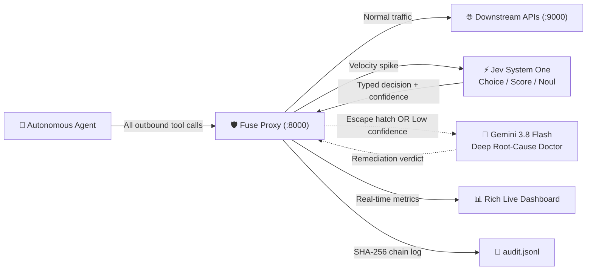

# Fuse — Intelligent Circuit Breaker for Autonomous AI Agents

> **Confidence-gated agent proxy powered by Jev (TypeSafe AI System One) and Gemini 3.8 Flash.**
> Protects downstream APIs, databases, and budgets from agent retry storms, runaway loops, and cascading rate limits—without killing legitimate parallel work.

[]()
[]()
[](https://typesafe.ai)
[]()
[](LICENSE)

---

## What is Fuse?

When autonomous AI agents encounter tool errors, they often panic: triggering unbacked retry storms, cycling in endless tool loops, or consuming thousands of dollars in downstream API quotas. 

Traditional rate limiters are **dumb counters**—they can't tell the difference between an agent reading 10 documents in parallel and an agent stuck in a death loop hitting the same endpoint 10 times.

**Fuse sits as a transparent reverse proxy between your AI agent and outbound APIs.** It evaluates every outbound call through a strict 3-layer safety hierarchy:

1. **Layer 1: Deterministic Hard Ceiling** — Inviolable sliding-window count limits. Pure arithmetic, zero AI bypass possible.
2. **Layer 2: Jev (TypeSafe AI System One)** — Millisecond typed classification (`Choice`, `Score`, `Noul`) with calibrated confidence, context-aware service profiling, and an `unrecognized` escape hatch.
3. **Layer 3: Gemini 3.8 Flash Root-Cause Engine** — Invoked only when Jev triggers its escape hatch or reports low confidence, diagnosing the root cause and suggesting automated remediation.

Every event is recorded to a **cryptographically hashed, tamper-evident audit log** (`audit.jsonl`).

---

## Why Fuse?

| Scenario | Traditional Rate Limiter | Fuse Intelligent Proxy |
|:---|:---|:---|
| **Parallel RAG Burst** (10 docs at once) | ❌ **Trips static limit** and crashes the agent turn | ✅ **Jev recognizes `parallel_work`** $\to$ Forwarded instantly |
| **Failing Endpoint Retry Storm** (10 identical calls) | ❌ Burns API budget or gets your API key banned | ✅ **Jev detects `retry_storm`** $\to$ Injects exponential backoff |
| **Cyclic Loop Bug** (Alternating tools, no progress) | ❌ Runs forever until token limits exhaust | ⚡ **Jev triggers `unrecognized` escape** $\to$ **Gemini 3.8 Flash** diagnoses loop root cause |
| **Catastrophic Rogue Burst** (25 rapid calls) | ❌ Unpredictable behavior | 🔴 **Layer 1 Hard Ceiling enforces 429 block** deterministically |

---

## System Architecture



---

## Installation

Ensure you have Python 3.12+ and [`uv`](https://docs.astral.sh/uv/) installed:

```bash
# 1. Clone repository
git clone https://github.com/your-org/Fuse.git
cd Fuse

# 2. Create virtual environment with uv
uv venv
source .venv/bin/activate  # On Windows: .venv\Scripts\activate

# 3. Install dependencies
uv pip install typesafe-sdk google-genai fastapi uvicorn httpx rich pydantic python-dotenv pytest pytest-asyncio
```

---

## Quickstart

Run the complete 4-act live demonstration in three easy steps:

### Step 1: Configure Environment

Copy the example template and supply your API keys:

```bash
cp .env.example .env
```

Edit `.env`:
```env
# TypeSafe AI Key (for Layer 2 Jev)
TYPESAFE_API_KEY=your_typesafe_key

# Gemini API Key (for Layer 3 Gemini 3.8 Flash)
GEMINI_API_KEY=your_gemini_key
GEMINI_MODEL=gemini-3.8-flash

# Proxy & Downstream Target Ports
PROXY_PORT=8000
TARGET_BASE_URL=http://localhost:9000
```

### Step 2: Start Mock Target Service & Fuse Proxy

In terminal 1, start the mock downstream service:
```bash
python demo/mock_server.py
```

In terminal 2, launch the Fuse proxy gateway:
```bash
python -m uvicorn src.proxy:app --port 8000
```

### Step 3: Run the 4-Act Live Demonstration

In terminal 3, run the automated scenario runner:
```bash
python demo/run_demo.py
```

You will see the live terminal dashboard intercepting the traffic in real time:
- **Act 1:** 10 parallel search requests forwarded without false-positive blocking.
- **Act 2:** 10 identical retry calls mitigated with automated exponential backoff.
- **Act 3:** Loop bug detected $\to$ Jev escapes to Gemini 3.8 Flash $\to$ Circuit tripped with remediation advice.
- **Act 4:** Rogue burst hits Layer 1 Hard Ceiling $\to$ Pure arithmetic blocks calls 21–25 with `429 Too Many Requests`.

---

## Configuration Reference

Key thresholds are configurable in [`.env`](.env) without modifying code:

| Setting | Default | Description |
|:---|:---|:---|
| `HARD_CEILING_CALLS` | `20` | Max calls allowed within window before Layer 1 hard blocks |
| `HARD_CEILING_WINDOW_SECONDS` | `10` | Time window for Layer 1 deterministic rate evaluation |
| `ANOMALY_THRESHOLD_CALLS` | `8` | Call rate spike that trips Layer 2 Jev evaluation |
| `ANOMALY_THRESHOLD_WINDOW_SECONDS` | `5` | Time window for velocity anomaly detection |
| `CONFIDENCE_HIGH` | `0.7` | Jev confidence threshold required to act directly without Layer 3 escalation |
| `CONFIDENCE_LOW` | `0.4` | Lower confidence bound below which LLM intervention is mandatory |
| `SEVERITY_DANGEROUS` | `1.5` | Score threshold triggering immediate human-in-the-loop escalation |

---

## Context-Aware Service Profiles

Fuse injects downstream service characteristics into Jev's `state` to ensure accurate risk classification:

- **`read_intensive`** (Search, Vector DBs): High concurrency tolerance; benign parallel bursts are allowed.
- **`standard_api`** (Default REST): Balanced thresholding; standard backoff on repeated 5xx/429 errors.
- **`high_consequence`** (Billing, Payments, SMS, Mutating APIs): Zero tolerance for unchecked retries; immediate backoff and safety alerts.

*Agents can pass an optional header `X-Fuse-Service: payments`, or Fuse automatically infers the profile from HTTP methods (`GET` vs `POST`/`DELETE`) and URL patterns.*

---

## Quota-Protective Burst Caching

To prevent autonomous agents from burning through model API credits during rapid bursts, Fuse deploys an **in-flight session decision cache**:
- When 10 concurrent requests arrive in Act 1, Fuse queries Jev **once**.
- The decision is cached for 3 seconds across the burst.
- Subsequent calls reuse the verdict with **zero additional API calls**.
- The entire 4-act demo executes with **~3 Jev calls** and **1 Gemini call** total.

---

## Cryptographic Tamper-Evident Audit Trail

Every intercepted decision is appended to [`audit.jsonl`](audit.jsonl) with SHA-256 chain hashing:

$$\text{chain\_hash}_n = \text{SHA-256}(\text{prev\_hash}_{n-1} \parallel \text{record\_json}_n)$$

This guarantees mathematical proof of non-tampering for compliance, engineering audits, and responsible AI evaluation.

---

## Development & Testing

Run the full automated test suite:

```bash
pytest tests/ -v
```

Test coverage includes:
- `tests/test_sliding_window.py` — Deterministic sliding window & hard ceiling limits.
- `tests/test_router.py` — Decision matrix, confidence gating, and escape hatch logic.
- `tests/test_proxy.py` — End-to-end FastAPI proxy forwarding, backoff injection, and 429 enforcement.

---

## Project Structure

```
Fuse/
├── .env.example              # Configuration template
├── README.md                 # Project documentation
├── pyproject.toml            # uv project metadata
├── docs/                     # Architectural specs & hackathon rubrics
│   ├── fuse_jev_architecture.md   # Complete visual architecture (8 Mermaid diagrams)
│   ├── implementation_plan.md     # Engineering roadmap & milestones
│   └── evaluation_metrics.md      # Award alignment & rubric criteria
├── src/                      # Core Fuse proxy implementation
│   ├── config.py             # Settings loader via pydantic & dotenv
│   ├── models.py             # Pydantic schemas (CallRecord, ServiceProfile, JevDecision)
│   ├── sliding_window.py     # Layer 1 deterministic counter & rate tracker
│   ├── jev_client.py         # Layer 2 TypeSafe SDK wrapper (Choice, Score, Noul)
│   ├── llm_client.py         # Layer 3 Gemini 3.8 Flash root-cause client
│   ├── router.py             # Confidence-gated routing engine with escape hatch
│   ├── proxy.py              # FastAPI reverse proxy gateway
│   ├── dashboard.py          # Rich live console & SHA-256 audit logger
│   └── simulator.py          # 4-act synthetic agent traffic generator
├── demo/                     # Live demo harness & submission assets
│   ├── mock_server.py        # Port 9000 downstream target simulator
│   ├── run_demo.py           # Automated 4-act scenario runner
│   └── demo_script.md        # 90-second video voiceover teleprompter script
└── tests/                    # Automated unit & integration tests
    ├── test_sliding_window.py
    ├── test_router.py
    └── test_proxy.py
```

---

## Hackathon Submission

Built for the **GOMYCODE × NVIDIA "Come Build with AI" Hackathon** (27 September 2026):
- 🏆 **Primary Target:** Thunders Engineering Excellence Award (Mac Mini)
- ⚡ **Secondary Target:** NVIDIA Brev Breakthrough Award (Responsible AI / Innovation)

---

## License

MIT License. See [LICENSE](LICENSE) for details.
