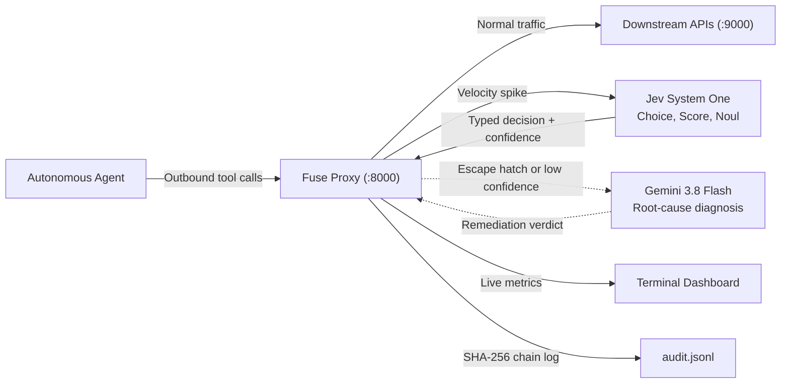

# Fuse: Circuit Breaker for Autonomous AI Agents

> Confidence-gated agent proxy built with Jev (TypeSafe AI System One) and Gemini 3.8 Flash.
> Protects downstream APIs, databases, and budgets from retry storms, runaway tool loops, and rate limit exhaustion, without stopping valid parallel work.

[]()
[]()
[](https://typesafe.ai)
[]()
[](LICENSE)

---

## What Fuse does

When autonomous agents hit tool errors, they often retry immediately without backoff, cycle between tools in loops, or exhaust third-party API quotas.

Standard rate limiters only count requests. They cannot distinguish between an agent querying 10 documents in parallel and an agent repeating the same failed query 10 times.

Fuse runs as a reverse proxy between your AI agent and outbound APIs. It inspects outgoing calls using three layers:

1. **Layer 1 (Sliding window ceiling):** A deterministic counter that blocks requests when call volume exceeds safety limits.
2. **Layer 2 (Jev System One):** Fast typed classification returning `Choice`, `Score`, and `Noul` with confidence values and an escape hatch for unexpected patterns.
3. **Layer 3 (Gemini 3.8 Flash):** Root-cause diagnosis invoked only when Jev flags an unclassified pattern or reports low confidence.

Every event is written to a SHA-256 chained audit log (`audit.jsonl`).

---

## Behavior comparison

| Scenario | Standard rate limiter | Fuse proxy |
|:---|:---|:---|
| Parallel burst (10 concurrent reads) | Blocks requests and breaks agent flow | Jev identifies parallel work and forwards calls |
| Failing endpoint retry storm (10 identical calls) | Consumes budget or gets credentials blocked | Jev flags retry storm and applies backoff |
| Cyclic tool loop (alternating tools, no progress) | Runs until agent token limit is reached | Jev triggers escape hatch, Gemini diagnoses the loop |
| Rogue traffic burst (25 rapid calls) | May permit excess calls depending on window | Layer 1 hard limit returns 429 after 20 calls |

---

## Architecture



---

## Installation

Requirements: Python 3.12 or newer and uv.

```bash
# 1. Clone repository
git clone https://github.com/your-org/Fuse.git
cd Fuse

# 2. Create virtual environment
uv venv
source .venv/bin/activate  # On Windows: .venv\Scripts\activate

# 3. Install dependencies
uv pip install typesafe-sdk google-genai fastapi uvicorn httpx rich pydantic python-dotenv pytest pytest-asyncio
```

---

## Quickstart

Run the 4-act demonstration in three steps:

### 1. Set environment variables

Copy `.env.example` to `.env`:

```bash
cp .env.example .env
```

Update `.env` with your API keys:

```env
TYPESAFE_API_KEY=your_typesafe_key
GEMINI_API_KEY=your_gemini_key
GEMINI_MODEL=gemini-3.8-flash
PROXY_PORT=8000
TARGET_BASE_URL=http://localhost:9000
```

### 2. Start mock server and proxy

Terminal 1:
```bash
python demo/mock_server.py
```

Terminal 2:
```bash
python -m uvicorn src.proxy:app --port 8000
```

### 3. Run the demo script

Terminal 3:
```bash
python demo/run_demo.py
```

The terminal dashboard shows each intercepted scenario:
- Act 1: 10 parallel search requests forwarded without blocking.
- Act 2: 10 repeated error calls throttled with exponential backoff.
- Act 3: Tool loop detected, routed to Gemini 3.8 Flash, circuit opened with repair advice.
- Act 4: Rogue burst blocked by Layer 1 counter once call count hits 20.

---

## Configuration

Settings are configured through `.env`:

| Variable | Default | Description |
|:---|:---|:---|
| `HARD_CEILING_CALLS` | `20` | Maximum calls allowed in the ceiling window before blocking |
| `HARD_CEILING_WINDOW_SECONDS` | `10` | Evaluation window in seconds for the Layer 1 hard ceiling |
| `ANOMALY_THRESHOLD_CALLS` | `8` | Call count within velocity window that triggers Jev evaluation |
| `ANOMALY_THRESHOLD_WINDOW_SECONDS` | `5` | Time window in seconds for velocity anomaly detection |
| `CONFIDENCE_HIGH` | `0.7` | Minimum Jev confidence to act without consulting Layer 3 |
| `CONFIDENCE_LOW` | `0.4` | Lower confidence limit that requires Layer 3 analysis |
| `SEVERITY_DANGEROUS` | `1.5` | Risk score threshold that triggers escalation |

---

## Service profiles

Fuse includes downstream service context in Jev state evaluations:

- `read_intensive` (search, vector databases): higher concurrency allowance for benign read bursts.
- `standard_api` (general REST endpoints): standard backoff rules on repeated 5xx or 429 status codes.
- `high_consequence` (billing, database updates, messaging): immediate backoff on errors to avoid unwanted side effects.

Agents can specify a profile using the `X-Fuse-Service` header. If absent, Fuse infers the profile from HTTP methods and URL paths.

---

## Burst caching

To conserve API calls during sudden spikes, Fuse caches Jev decisions for 3 seconds per service profile.

During a 10-request parallel burst, Fuse evaluates the first call with Jev and applies the cached decision to the remaining 9 calls. The complete 4-act demo runs with 3 Jev calls and 1 Gemini call.

---

## Audit logging

Every intercepted call is written to `audit.jsonl` using a SHA-256 hash chain:

$$\text{chain\_hash}_n = \text{SHA-256}(\text{prev\_hash}_{n-1} \parallel \text{record\_json}_n)$$

Each record includes the previous record's hash, so modifying or removing an entry breaks the chain.

---

## Testing

Run the test suite:

```bash
pytest tests/ -v
```

The 15 automated tests verify:
- `tests/test_sliding_window.py`: Sliding window counters and ceiling enforcement.
- `tests/test_router.py`: Decision routing, confidence gating, and escape hatch handling.
- `tests/test_proxy.py`: Proxy forwarding, backoff injection, and 429 responses.

---

## Project structure

```
Fuse/
├── .env.example              # Configuration template
├── README.md                 # Project documentation
├── pyproject.toml            # Project dependencies and settings
├── docs/                     # Specifications and architecture documents
│   ├── fuse_jev_architecture.md   # System architecture and Mermaid diagrams
│   ├── implementation_plan.md     # Implementation notes and milestones
│   └── evaluation_metrics.md      # Hackathon rubric alignment
├── src/                      # Proxy source code
│   ├── config.py             # Settings loader
│   ├── models.py             # Data schemas (CallRecord, ServiceProfile, JevDecision)
│   ├── sliding_window.py     # Layer 1 counter and rate tracking
│   ├── jev_client.py         # Layer 2 TypeSafe Jev client
│   ├── llm_client.py         # Layer 3 Gemini 3.8 Flash client
│   ├── router.py             # Decision router and confidence checks
│   ├── proxy.py              # FastAPI reverse proxy gateway
│   ├── dashboard.py          # Terminal metrics and audit logging
│   └── simulator.py          # Demo traffic generator
├── demo/                     # Demo scripts and downstream mock
│   ├── mock_server.py        # Local mock API on port 9000
│   ├── run_demo.py           # Demo runner for Acts 1 through 4
│   └── demo_script.md        # Video demonstration script
└── tests/                    # Automated test suite
    ├── test_sliding_window.py
    ├── test_router.py
    └── test_proxy.py
```

---

## Hackathon submission

Built for the GOMYCODE x NVIDIA Hackathon (September 27, 2026).
- Primary track: Thunders Engineering Excellence Award
- Secondary track: NVIDIA Brev Breakthrough Award

---

## License

MIT License. See [LICENSE](LICENSE) for details.
