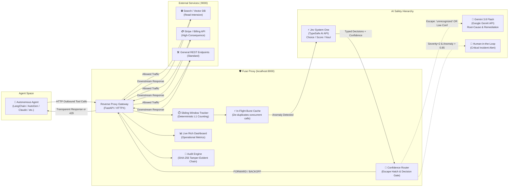
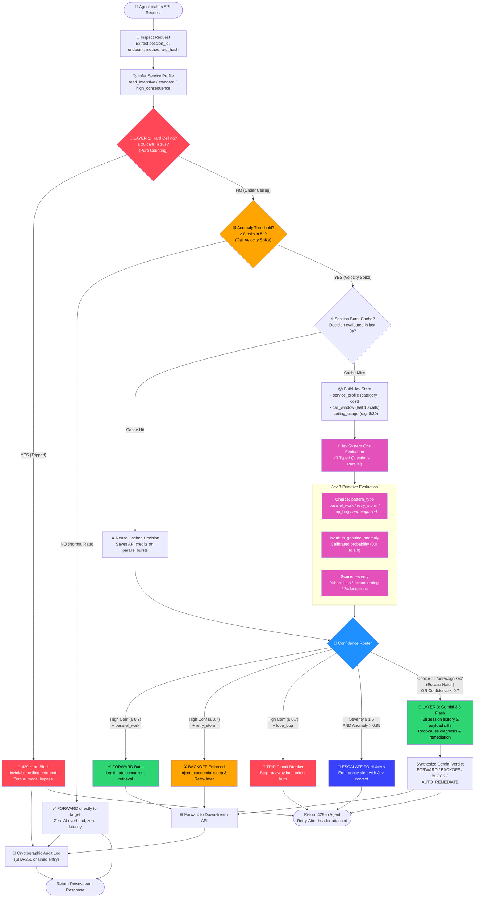
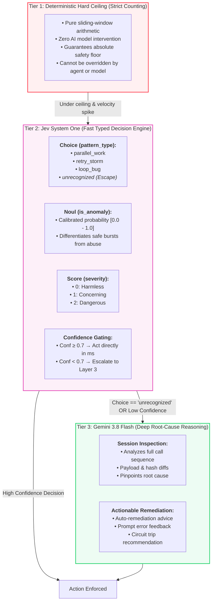
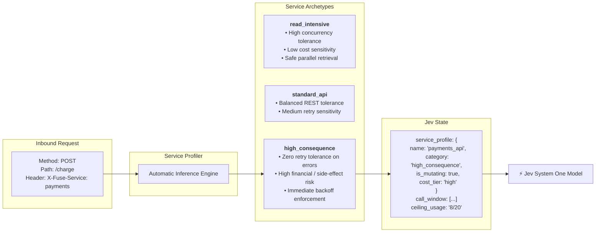
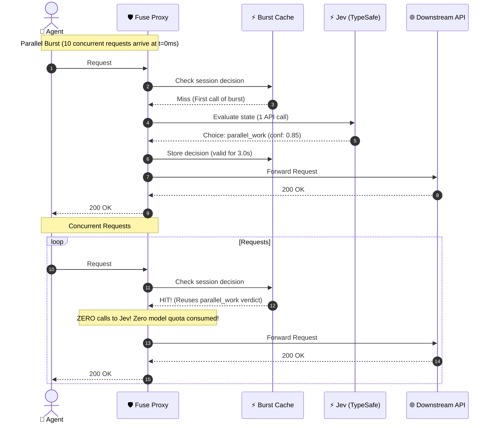
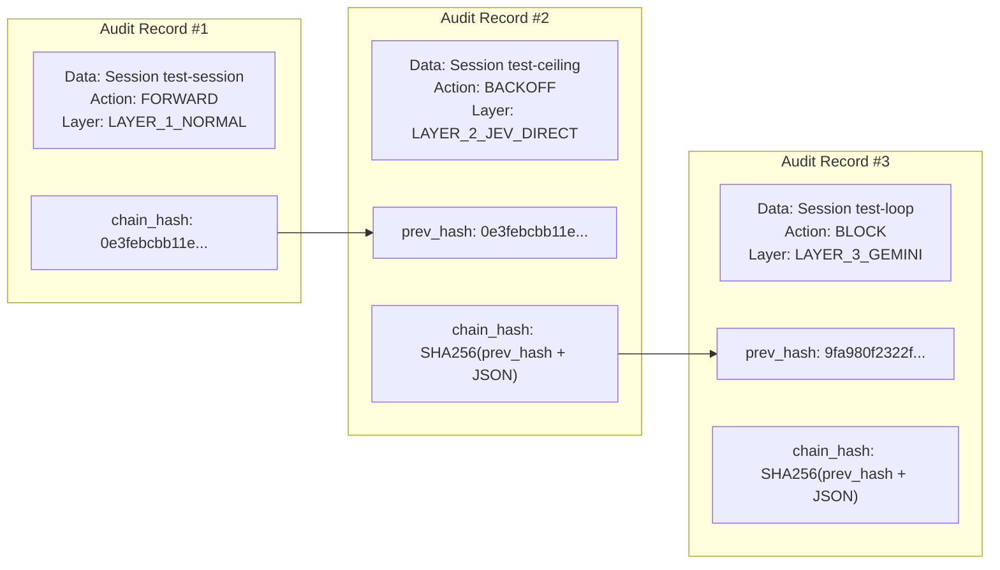
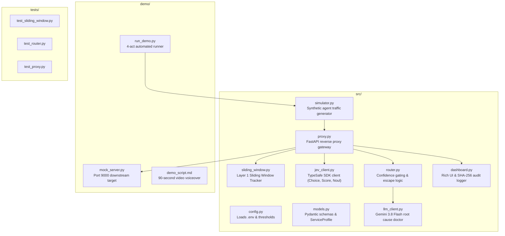

# Fuse Architecture — Intelligent Circuit Breaker with Jev & Gemini

> **Executive Overview:** Fuse is an intelligent, confidence-gated proxy that sits between autonomous AI agents and downstream APIs.
> It uses a strict 3-tier safety hierarchy:
> 1. **Layer 1: Deterministic Hard Ceiling** — pure sliding-window counting, inviolable, zero AI override.
> 2. **Layer 2: Jev (TypeSafe AI System One)** — fast typed primitives (`Choice`, `Score`, `Noul`) with calibrated confidence, context-aware service profiling, and an `unrecognized` escape hatch.
> 3. **Layer 3: Gemini 3.8 Flash (Deep Root-Cause Engine)** — invoked only when Jev escapes or is uncertain, conserving API quotas while diagnosing complex failures.

---

## 1. High-Level System Context

---

## 2. End-to-End Decision Flowchart

This flowchart illustrates every branch a call can take, including the **Service Profile Injection**, the **Burst Cache**, the **Layer 2 Escape Hatch**, and the **Deterministic Layer 1 Hard Ceiling**.

---

## 3. The 3-Tier Layered Architecture

---

## 4. Context-Aware Service Profile Injection

Why can Jev distinguish between safe bursts and dangerous storms? Because **State is Context**. Fuse injects downstream service characteristics into Jev's evaluation:

---

## 5. Quota-Protective Burst De-Duplication Cache

To guarantee that autonomous agents executing concurrent parallel bursts do not burn through model API quotas, Fuse deploys an in-flight burst cache:

---

## 6. The 4 Live Demonstration Acts (How They Map to the Layers)

```mermaid
graph TD
    subgraph ACT1["Act 1: Parallel Work Burst"]
        A1["10 concurrent RAG searches<br/>(Diverse arg hashes)"] --> A1_RES["Layer 2 (Jev System One)<br/>Choice: <b>parallel_work</b> (conf: 0.85)<br/>Action: <b>FORWARD</b> (Safe Burst)"]
    end

    subgraph ACT2["Act 2: Stuck Retry Storm"]
        A2["10 identical calls to failing 503<br/>(Identical arg hash)"] --> A2_RES["Layer 2 (Jev System One)<br/>Choice: <b>retry_storm</b> (conf: 0.92)<br/>Action: <b>BACKOFF</b> (4.0s Sleep + Header)"]
    end

    subgraph ACT3["Act 3: Loop Bug & Escape Hatch"]
        A3["Alternating tool cycle<br/>(step-A -> step-B with no progress)"] --> A3_RES["Layer 2 triggers <b>'unrecognized' Escape</b><br/>→ Layer 3 (Gemini 3.8 Flash)<br/>Action: <b>CIRCUIT TRIP (429)</b> with advice"]
    end

    subgraph ACT4["Act 4: Catastrophic Rogue Burst"]
        A4["25 rapid calls in < 1 second<br/>(Exceeds ceiling of 20)"] --> A4_RES["Layer 1 (Deterministic Ceiling)<br/>Arithmetic: 25 ≥ 20<br/>Action: <b>HARD 429 BLOCK</b> (Zero AI bypass)"]
    end

    style ACT1 fill:#2ed57315,stroke:#2ed573
    style ACT2 fill:#ffa50215,stroke:#ffa502
    style ACT3 fill:#E551BA15,stroke:#E551BA
    style ACT4 fill:#ff475715,stroke:#ff4757
```

---

## 7. Cryptographic Tamper-Evident Audit Trail

Every event processed by Fuse is appended to `audit.jsonl` with SHA-256 chain hashing, ensuring accountability for responsible AI operations:

---

## 8. Codebase Topology & Component Map

