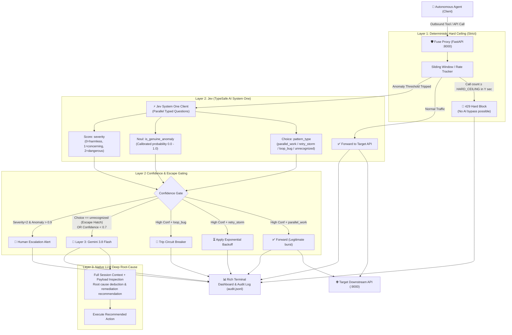

# Fuse — Implementation Plan & Battle Blueprint

> **Mission:** Build and demonstrate **Fuse** — an intelligent, confidence-gated circuit breaker proxy for AI agent tool calls.
> **Target Awards:** 
> 1. 🏆 **Mac Mini** (Thunders Engineering Excellence Award)
> 2. ⚡ **NVIDIA Brev Breakthrough Award** (Responsible AI / Innovation)
> **Stack:** Python 3.12, FastAPI, `uv`, TypeSafe SDK (Jev System One), Google GenAI (`gemini-3.8-flash`), Rich, Pytest.

---

## 1. System Architecture & Safety Hierarchy



---

## 2. Component Design & Directory Structure

```
Fuse/
├── .env                          # Local credentials (gitignored)
├── .env.example                  # Template configuration
├── .gitignore                    # Gitignore rules
├── AGENT.md                      # Agent context & conventions
├── README.md                     # Project documentation & setup
├── pyproject.toml                # uv project metadata
├── docs/                         # Rules, context, metrics, awards
│   ├── CONTEXT.md
│   ├── rules.md
│   ├── evaluation_metrics.md
│   ├── award_strategy.md
│   ├── karpathy_rules.md
│   └── implementation_plan.md
├── src/                          # Core proxy implementation
│   ├── __init__.py
│   ├── config.py                 # Configuration via pydantic-settings / dotenv
│   ├── models.py                 # Pydantic data schemas (calls, events, verdicts)
│   ├── sliding_window.py         # Deterministic sliding window & rate tracker (L1)
│   ├── jev_client.py             # TypeSafe SDK wrapper for Jev System One (L2)
│   ├── llm_client.py             # Gemini 3.8 Flash client for root cause (L3)
│   ├── router.py                 # Confidence-gated routing logic with escape hatch
│   ├── proxy.py                  # FastAPI reverse proxy application
│   ├── dashboard.py              # Rich live terminal UI & audit logger
│   └── simulator.py              # Traffic pattern generator for demo & tests
├── tests/                        # Automated test suite
│   ├── __init__.py
│   ├── test_sliding_window.py    # Hard ceiling & anomaly window tests
│   ├── test_router.py            # Routing decision table unit tests
│   └── test_proxy.py             # End-to-end proxy integration tests
└── demo/                         # 90-second demo scripts & video materials
    ├── CONTEXT.md
    ├── mock_server.py            # Mock downstream API (status codes & latency)
    ├── run_demo.py               # Automated 4-act scenario runner
    └── demo_script.md            # Spoken voiceover and scene timings
```

---

## 3. The 4 Demo Scenarios (The Proof for Judges)

To win **Engineering Excellence** and **Breakthrough Innovation**, our demo must visibly prove all 4 behaviors live:

| Act | Scenario | Agent Behavior | Traditional Proxy / Rate Limiter | Fuse Intelligent Proxy |
|:---|:---|:---|:---|:---|
| **Act 1** | **Parallel Burst** | Agent searches 10 documents simultaneously across different endpoints | ❌ **Trips static limit** and crashes agent | ✅ **Jev recognizes `parallel_work`** with high confidence → **Forwarded immediately** |
| **Act 2** | **Stuck Retry Storm** | Agent hits failing endpoint 10x with identical payload | ❌ Burns API budget / gets IP banned | ✅ **Jev detects `retry_storm`** → Injects **exponential backoff** without crashing |
| **Act 3** | **Unrecognized / Loop Bug** | Agent alternates between two tools with no state progression | ❌ Unhandled until budget exhausted | ⚡ **Jev triggers `unrecognized` escape** → **Gemini 3.8 Flash** diagnoses loop root cause |
| **Act 4** | **Catastrophic Ceiling** | Agent goes completely rogue (50 calls in 2 seconds) | ❌ Inconsistent behavior | 🔴 **Layer 1 Hard Ceiling trips deterministically** → **Strict 429 block** (Zero AI bypass) |

---

## 4. Step-by-Step Implementation Milestones

### Milestone 1: Environment & Dependencies (DONE)
- [x] Create `.venv` using `uv venv`
- [x] Configure `.env` with TypeSafe API key, Gemini API key, model (`gemini-3.8-flash`), and thresholds
- [x] Install `typesafe-sdk`, `google-genai`, `fastapi`, `uvicorn`, `httpx`, `rich`, `pydantic`, `pytest` via `uv`

### Milestone 2: Core Domain Models & Configuration (`config.py`, `models.py`)
- Define `Settings` using `python-dotenv`.
- Define `CallMetadata`: `call_id`, `session_id`, `timestamp`, `method`, `endpoint`, `arg_hash`, `status_code`, `latency_ms`.
- Define `JevState`: Sliding window slice + prior decisions + ceiling count.
- Define `RoutingDecision`: Action (`FORWARD`, `BACKOFF`, `BLOCK`, `ESCALATE_LLM`, `ESCALATE_HUMAN`), confidence, reasoning, layer source.

### Milestone 3: Layer 1 Deterministic Counter (`sliding_window.py`)
- Thread-safe sliding window tracking calls per session and global call rates.
- Strict checking:
  - `is_hard_ceiling_breached(session_id)`: Immediate block, no AI evaluation.
  - `is_anomaly_threshold_breached(session_id)`: Triggers Jev evaluation.

### Milestone 4: Layer 2 Jev System One Client (`jev_client.py`)
- Initialize `AsyncTypeSafeClient(api_key=...)`.
- Issue 3 parallel typed primitives:
  - `Choice`: `pattern_type` (`parallel_work`, `retry_storm`, `loop_bug`, `unrecognized`).
  - `Noul`: `is_genuine_anomaly` (probability float).
  - `Score`: `severity` (0=harmless, 1=concerning, 2=dangerous).
- Include graceful fallback / mock mode for testing without exhausting API credits.

### Milestone 5: Layer 3 Gemini 3.8 Flash Root-Cause Client (`llm_client.py`)
- Initialize `google-genai` client using `GEMINI_API_KEY` and `GEMINI_MODEL=gemini-3.8-flash`.
- Format prompt with session call history, arg hashes, and Jev's output.
- Return structured diagnosis: root cause, suggested remediation, whether to terminate or retry.

### Milestone 6: Confidence-Gated Router (`router.py`)
- Pure, verifiable decision matrix implementing:
  - Escape hatch when `pattern == "unrecognized"` -> LLM
  - High confidence (`>= 0.7`) + `parallel_work` -> Forward
  - High confidence (`>= 0.7`) + `retry_storm` -> Backoff
  - High confidence (`>= 0.7`) + `loop_bug` -> Circuit Trip
  - Dangerous severity (`>= 1.5` & `anomaly > 0.9`) -> Human Escalation
  - Ambiguous / low confidence (`< 0.7`) -> LLM Root-Cause Analysis

### Milestone 7: Reverse Proxy & Downstream Forwarder (`proxy.py`)
- FastAPI app listening on port 8000.
- Intercepts all HTTP methods (`GET`, `POST`, `PUT`, `DELETE`).
- Calculates `arg_hash` from request body/params.
- Checks Layer 1 → (Layer 2 / Layer 3) → forwards to `TARGET_BASE_URL` (port 9000).
- Returns transparent response or appropriate safety response (`429 Too Many Requests` or backoff headers).

### Milestone 8: Live Terminal UI & Audit Logger (`dashboard.py`)
- Rich Live table displaying:
  - Real-time call stream
  - Active layer trigger (L1 Ceiling, L2 Jev, L3 Gemini)
  - Jev calibrated confidence bar and choice
  - Cumulative metrics (calls forwarded, blocks prevented, cost saved)
- Writes audit log to `audit.jsonl` with cryptographically verifiable hashes.

### Milestone 9: Traffic Simulator & Mock Server (`simulator.py`, `mock_server.py`)
- Mock target server providing realistic downstream responses (200 OK, 503 Service Unavailable, simulated latency).
- Simulator executing the 4 demonstration acts cleanly from a single command.

### Milestone 10: Verification, Automated Tests & Demo Script
- Pytest suite testing sliding window, router edge cases, and proxy forward/block semantics.
- Rehearsed 90-second run script with precise timing for screen recording.
